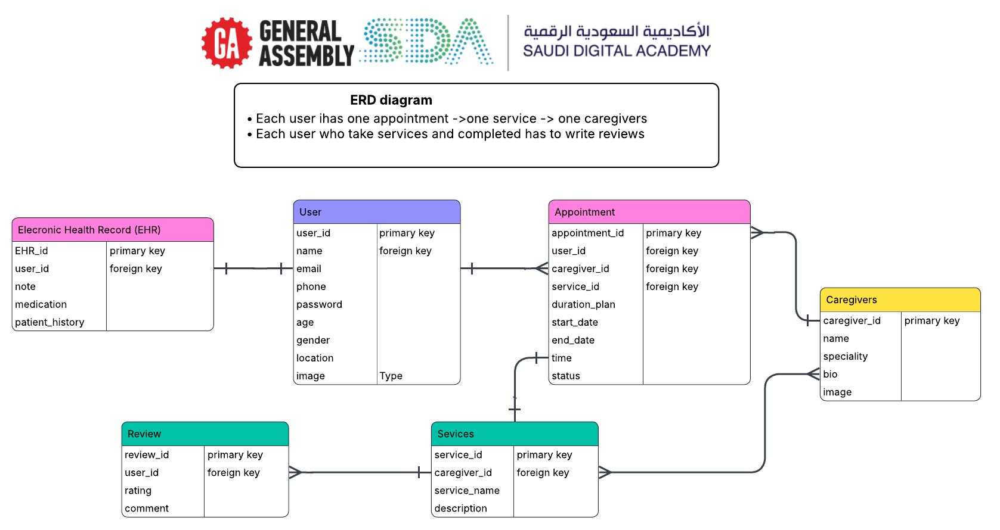

  <a href="https://generalassemb.ly/">
    
  

### Frontend Repository    [GoldenCare Frontend](https://github.com/RaghadAlbeladi1/GoldenCare-frontend/tree/main)
    
## RESTful Routing Table

##  Authentication

| HTTP Method | Path | Action | Description |
|------------|------|--------|-------------|
| `POST` | `/users/signup/` | create | Register a new user (patient) |
| `POST` | `/users/login/` | create | User login (returns token) |
| `GET` | `/users/token/refresh/` | show | Refresh token (verify user) |
| `POST` | `/users/token/refresh/` | create | Refresh access token |

##  Caregivers

| HTTP Method | Path | Action | Description |
|------------|------|--------|-------------|
| `GET` | `/caregivers/` | index | List all caregivers |

## Services

| HTTP Method | Path | Action | Description |
|------------|------|--------|-------------|
| `GET` | `/services/` | index | List all active services |

## Appointments

| HTTP Method | Path | Action | Description |
|------------|------|--------|-------------|
| `GET` | `/appointments/` | index | List all appointments for current user |
| `POST` | `/appointments/` | create | Book a new appointment |
| `GET` | `/appointments/<int:appointment_id>/` | show | Show appointment details |
| `PUT` | `/appointments/<int:appointment_id>/` | update | Update appointment (reschedule or add notes) |
| `DELETE` | `/appointments/<int:appointment_id>/` | destroy | Cancel appointment |

##  EHR (Electronic Health Records)

| HTTP Method | Path | Action | Description |
|------------|------|--------|-------------|
| `GET` | `/ehr/` | show | Get EHR record for current user |
| `GET` | `/ehr/notes/` | index | Get all notes for current user |
| `POST` | `/ehr/notes/` | create | Add a new note |
| `PUT` | `/ehr/notes/<int:note_id>/` | update | Update note |
| `DELETE` | `/ehr/notes/<int:note_id>/` | destroy | Delete note |

## Reviews 

| HTTP Method | Path | Action | Description |
|------------|------|--------|-------------|
| `GET` | `/reviews/` | index | Get all public reviews (displayed on website) |
| `POST` | `/reviews/` | create | Add review (requires completed service) |
| `GET` | `/reviews/<int:review_id>/` | show | Show review details |
| `PUT` | `/reviews/<int:review_id>/` | update | Update own review |
| `DELETE` | `/reviews/<int:review_id>/` | destroy | Delete own review |

### ERD Diagram w/ three models, User Model, & Relationships

- user model, appointmet mode (CRUD),Reviews (CRUD), Caregivers, Electronic Health Record(EHR)

  

## User Stories

| # | Role | Task |
|---|------|------|
| 1 | As a **user** | I want to **sign up** for an account |
| 2 | As a **user** | I want to **login** to my account |
| 3 | As a **user** | I want to **logout** from my account |
| 4 | As a **user** | I want to **view** my profile information |
| 5 | As a **user** | I want to **update** my profile information |
| 6 | As a **user** | I want to **delete** my account |
| 7 | As a **user** | I want to **view all** available services |
| 8 | As a **user** | I want to **view** service details |
| 9 | As a **user** | I want to **search** for services by name |
| 10 | As a **user** | I want to **view all** available caregivers |
| 11 | As a **user** | I want to **view** caregiver details |
| 12 | As a **user** | I want to **book** an appointment |
| 13 | As a **user** | I want to **choose duration** (day/month/3 months) when booking |
| 14 | As a **user** | I want to **select date and time** for my appointment |
| 15 | As a **user** | I want to **view all** my appointments |
| 16 | As a **user** | I want to **view** my current active appointment |
| 17 | As a **user** | I want to **view** my appointment history |
| 18 | As a **user** | I want to **update** my appointment details |
| 19 | As a **user** | I want to **add notes** to my appointment |
| 20 | As a **user** | I want to **cancel** my appointment |
| 21 | As a **user** | I want to **mark** my appointment as completed |
| 22 | As a **user** | I want to **add** a medical note |
| 23 | As a **user** | I want to **add** medication information |
| 24 | As a **user** | I want to **view all** my health records |
| 25 | As a **user** | I want to **view** only my notes |
| 26 | As a **user** | I want to **view** only my medications |
| 27 | As a **user** | I want to **update** my health records |
| 28 | As a **user** | I want to **delete** a health record |
| 29 | As a **user** | I want to **view all** public reviews |
| 30 | As a **user** | I want to **write** a review after completing service |
| 31 | As a **user** | I want to **rate** my experience (1-5 stars) |
| 32 | As a **user** | I want to **write comment** about my experience |
| 33 | As a **user** | I want to **view** my own reviews |
| 34 | As a **user** | I want to **delete** my reviews |

#### Review 
- User can write review **ONLY after completing service**
- Reviews will apear for all **visitors in public page**
- Rating with **1-5 stars** and write **comments and feedback**

